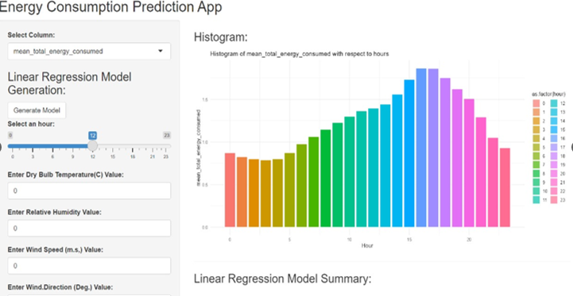

# Predicting-Energy-Consumption

### Introduction:
I analyzed data for the energy department of South Carolina to devise strategies for reducing energy consumption during the summer season. This involved consolidating over 100 CSV files containing various datasets such as static house information, weather data, and energy usage records. I applied both linear regression and XG Boost models to extract valuable insights.

Additionally, I developed an interactive Shiny dashboard to present the data in a user-friendly manner, facilitating better comprehension and engagement with the energy data.

Based on the analysis, a key recommendation emerged:
Implementing a dynamic pricing plan where energy rates fluctuate based on the time of day. This strategy aims to incentivize consumers to reduce energy usage during peak hours by increasing the rates, while offering lower rates during periods of lower consumption.

 
 

### Glimpse of the Shiny App:

  

